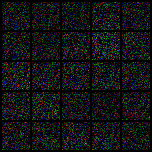
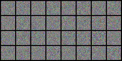
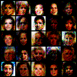
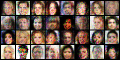
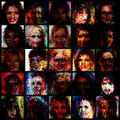
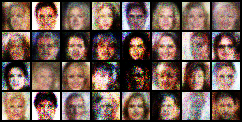
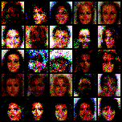
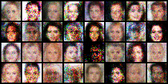

# celebA_gan
* 단순 MLP를 사용한 GAN으로 celebA 얼굴 이미지를 학습, 생성한다.
* pytorch를 사용, celebA dataset은 resize해서 따로 생성해둔것을 loader로 로드한다.

* [Generative Adversarial Networks](https://arxiv.org/abs/1406.2661) 참고하여 작성.
***
* Discriminator : FC-LeakyReLU-FC-LeakyReLU-FC-Sigmoid
* Generator : FC-BatchNorm1d-ReLU-FC-BatchNorm1d-ReLU-FC-Tanh

* Loss ftn : Mean Squared Error
* Optimizer : Adam
***
* Discriminator : random Z값으로 fake, Real data 분별하게 학습
* Generator : random Z값으로 생성한 fake를 discriminator가 real로 판별하도록 학습

* 생성/분별 시 RGB를 따로 처리할 필요가 있음. 따라서 (image size)*3의 학습 용량을 가짐.

* 학습과정을 보기 위해 random Z값이 아닌 고정된 Z값으로 생성한 이미지도 출력.

| epoch | result | result(fixed z) |
|:---:|:---:|:---:|
| 0 |  |  |
| 100 |  |  |
| 100 |  |  |
| 200 |  |  |

* 단순 MLP(fully connected layer만 사용)가 아닌 convolution을 사용한 DCGAN을 사용하면 조금이나마 자연스러운 결과를 가져온다.

* 사람의 얼굴은 MLP에서 처리하기엔 너무 복잡한 DATA를 가지고 있는 듯 하다.